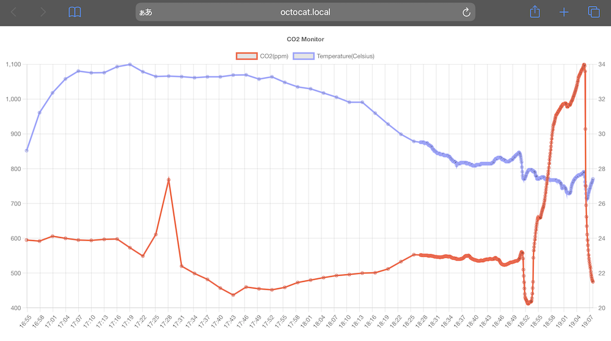

# The world's most programmer-friendly CO2 Monitor

Why is this the world's most?
Because Octocat is the most beloved mascot of programmers in the world. I think. ฅ^•ω•^ฅ





## Features

- Display CO2 value in 5x5 LED matrix `Round(CO2ppm / 100)`
    - 4-7 Green color
    - 8-9 Yellow color
    - 10-19 Red color
    - over 20 (means 2000ppm~) Red filled rectangle is displayed
- Web server [http://octocat.local](http://octocat.local)
    - CO2 & temperature log graph for 24 Hours (GET /)
    - CO2 Sensor manual calibration (GET /calibrate)
    - mDNS support
- WiFi turn ON/OFF
    - push the LED Matrix button


## Circuit diagram


- Octocat Figurine 3 inch (GitHub Shop)
- M5Stack Atom Matrix
- CO2 Sensor MH-Z19C
- 5V output DCDC boost converter
- Diode 1S2076A
- Electrolytic capacitor 47uF
- Ceramic capacitor 0.1uF
- DC jack (if needed)


## How to build and upload to the device

### Pre-requirement
- PlatformIO 

```
% git clone https://github.com/komasayuki/co2-monitor.git
% cd co2-monitor

# make your own settings file
% cp ./src/config_CHANGE_ME_.h ./src/config.h

# change WiFi settings
% vi ./src/config.h

# build
% platformio run

# upload to MtStack Atom Matrix
% platformio run -t upload
```


## How to calibrate
Please take this device outside and open /calibrate in the browser when the CO2 value settles down.
[http://octocat.local/calibrate](http://octocat.local/calibrate)


## If you want to change HTML for /

```
% cd tool
% npm install

% vi monitor.html

# minify and convert tool/monitor.html to src/indexhtml.h for arduino 
% npm start
```


## Do you know?

Octocat isn't her name. Her name is Monalisa.